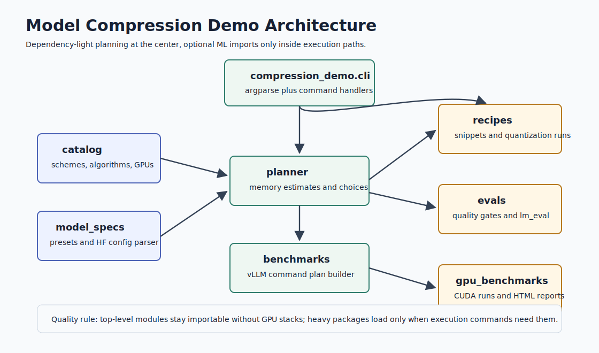
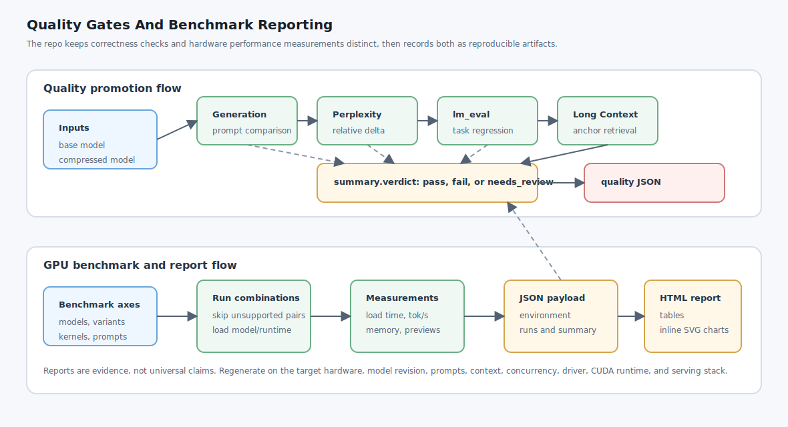

# Code Architecture

This project keeps the default command-line experience dependency-light while still documenting and testing heavier model-compression workflows. The package modules are organized around stable data, planning, command generation, and optional execution.

## Module Responsibilities

- `compression_demo.catalog` defines the static compression schemes, algorithms, and GPU instance catalog used by both the CLI and the guide.
- `compression_demo.model_specs` resolves architecture presets or local Hugging Face `config.json` files into planner inputs.
- `compression_demo.planner` estimates serving and compression memory, chooses default algorithms, and recommends runtime targets.
- `compression_demo.recipes` renders reference quantization snippets and runs the small set of executable quantization paths.
- `compression_demo.benchmarks` builds reproducible vLLM benchmark command plans without importing GPU libraries.
- `compression_demo.evals` builds and runs quality gates for generation, perplexity, long-context probes, and `lm_eval` tasks.
- `compression_demo.gpu_benchmarks` owns local CUDA benchmark execution plus the generated HTML and JSON reports.
- `compression_demo.cli` parses arguments and dispatches to small command handlers that call the modules above.

## Import Policy

Normal standard-library and package imports live at module top. Optional ML stacks such as `torch`, `transformers`, `datasets`, `bitsandbytes`, `llmcompressor`, and `lm_eval` remain lazy inside execution functions. That keeps planning, docs checks, and the default test suite usable on a normal Python install while preserving clear import order for the dependency-light modules.

## Workflow Shape

Planning commands produce estimates and shell commands. Execution commands create compressed checkpoints or measured report files. Promotion should require the quality gate summary, task metrics, and hardware-specific benchmark data from the target runtime.